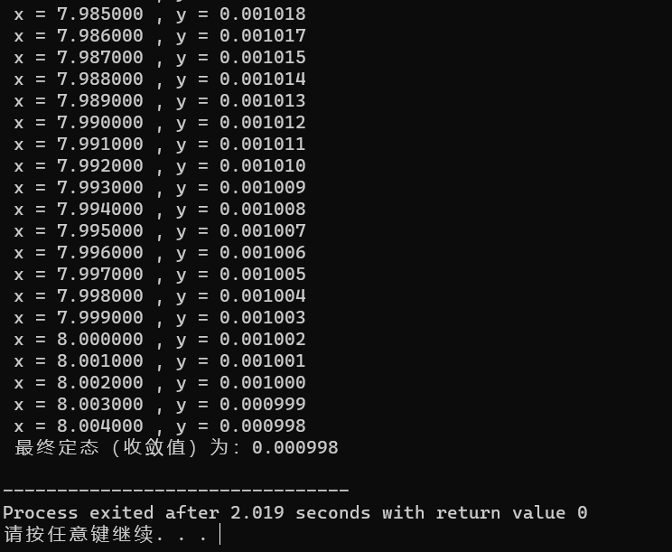
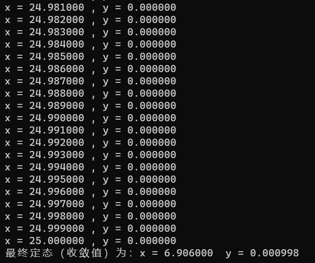
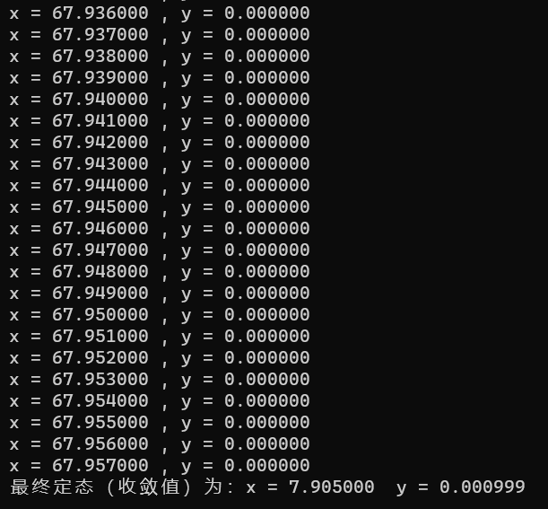
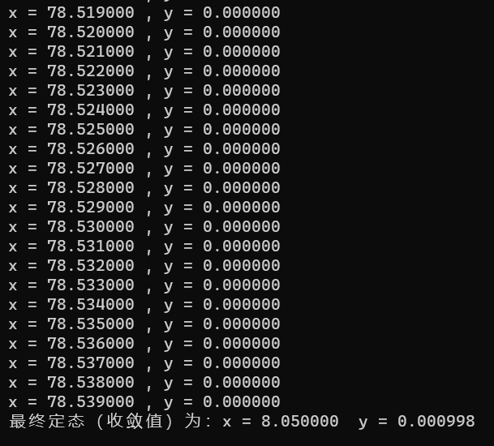
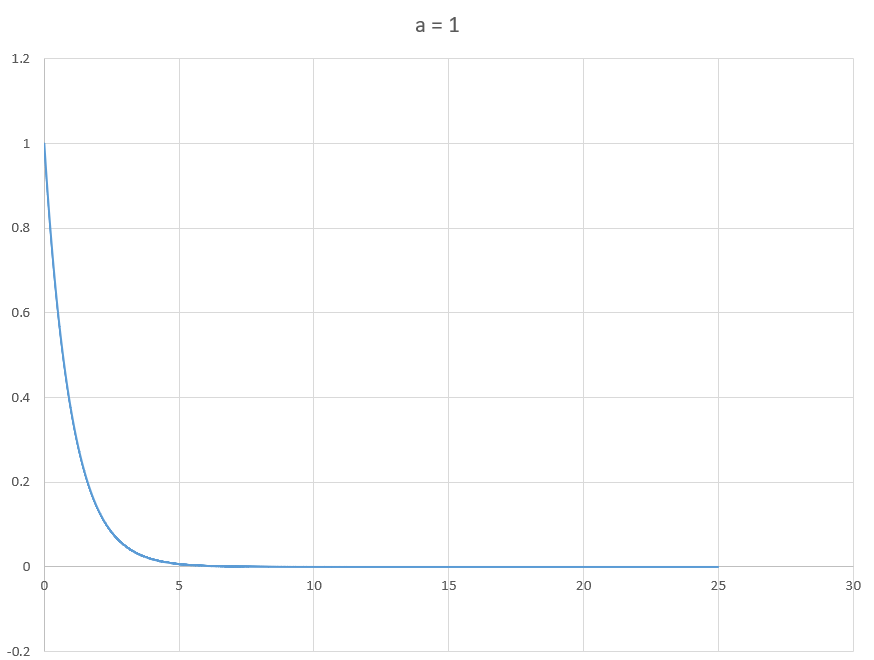
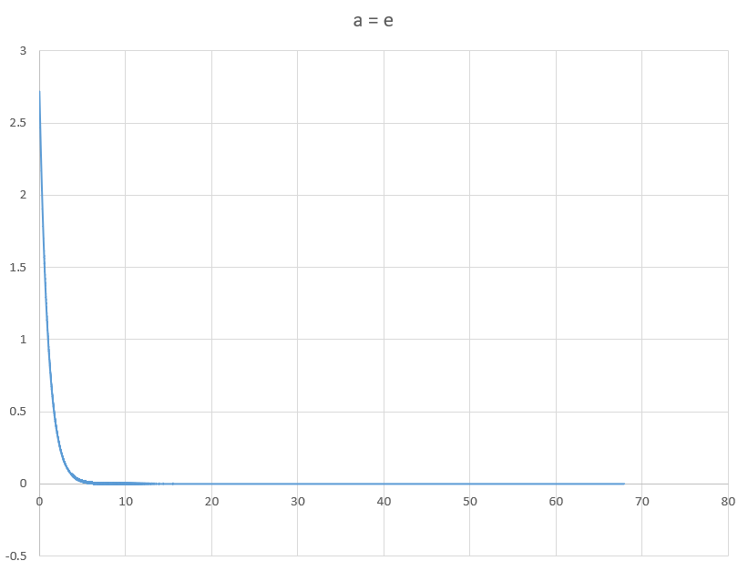
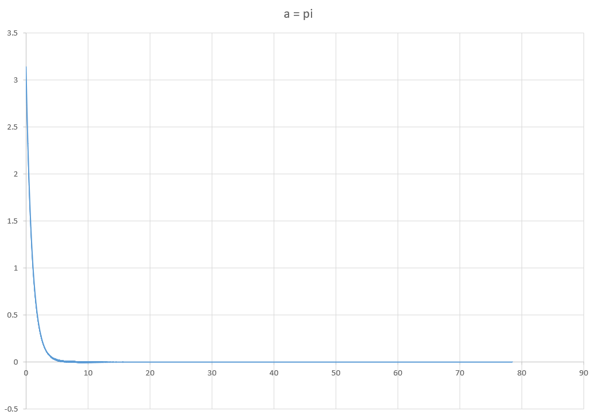

# 任务1实验报告

### 题目

  运用C语言，使用Euler法、梯形法、改进Euler法、Taylor级数法、Runge-Kutta法、线性多步法等任意一种方法，实现对下述简单微分方程的各个瞬时值与最终定态（收敛值）求解：

        

  注：a为常数，可由用户输入确定该值。你可以使用scanf()函数来获取输入的a值。瞬时值求解时步长为0.001，当迭代计算时前后两个值的差小于0.001倍的步长时，该值就认为是定态值。

------

### 运行结果截图：

------

### 思考题（请给出思考结论）：

1. 当a为1，给出x在区间[0，25]之间方程的各个瞬时值，该方程的最终定态（收敛值）是多少？

   

2. 当a为e，给出x在区间[0，25*e]之间方程的各个瞬时值，最终定态（收敛值）是多少？（e为指数）

   

3. 当a为π，给出x在区间[0，25*π]之间方程的各个瞬时值，最终定态（收敛值）是多少？

   

4. 上面三小问中不同初值的方程最终都能取到各自的最终定态（收敛值），为什么？

   **对于三个不同的初值条件，最终都能取到各自的最终定态（收敛值），这是因为欧拉法是一种单步法，每次迭代只与上一次迭代有关，所以不同初值条件下的迭代过程不会相互影响。**

#### 附加题：

使用C语言对上述前三问的数值求解过程用Excel画图显示，即将每一个x对应的y值在坐标系上画出来，并将绘出的图片附在下面。

