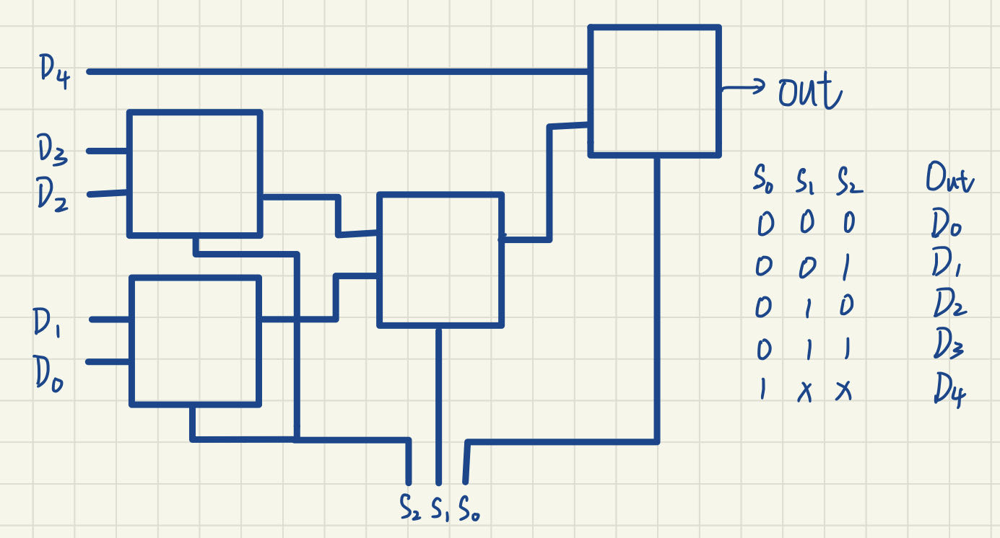
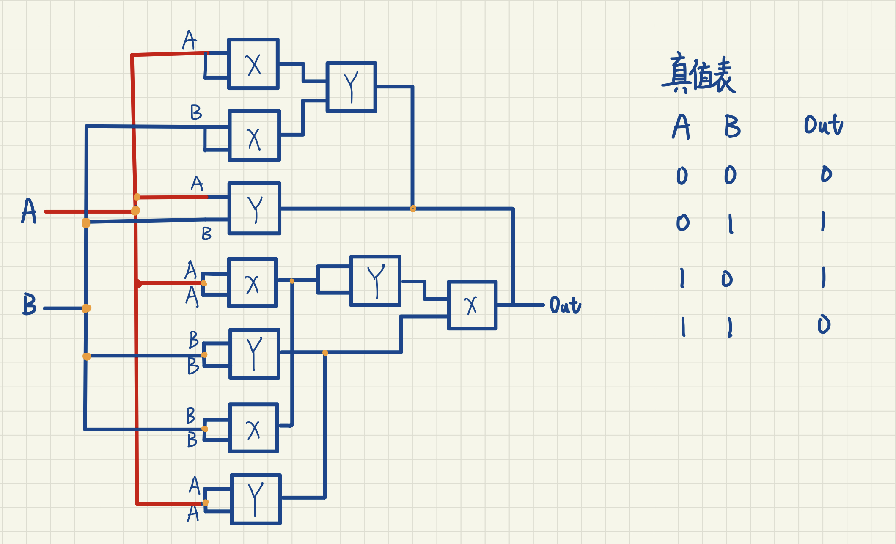

# 任务3

### 题目一

多选器是一种基本的数字电路器件，其功能如下：

图(a)为一个2选1选择器。A,B,s作为输入端，其中A，B为1位的数据输入，s为1位的选择信号，Out为1位的输出端，当s=0时out=B，当s=1时out=A。

1. 如何使用图(a)所示的2选1多选器设计一个具有5个数据输入的多选器？这个多选器需要几位选择信号? 画出你的设计。

   需要三位选择信号

   

2. 如果使用图(a)所示的2选1多选器设计一个具有n个数据输入的多选器, 需要多少个2选1的选择器? 写下你的结论和思考步骤。

   n-1个。首先，需要确定多选器的选择信号的位数。由于有n个数据输入，所以需要log2(n)位的选择信号来表示n种可能的选择。

   其次，需要确定如何连接2选1的选择器。例如采用层次化的结构，每一层使用一位选择信号来控制输出。例如，如果n=4，可以先用两个2选1的选择器将四个输入分成两组，然后用另一个2选1的选择器将两组输出再次选择。这样，就可以用3个2选1的选择器和2位的选择信号来实现4选1的多选器。
   
   最后，推广这个思路，对于任意的n，可以用n-1个2选1的选择器和log2(n)位的选择信号来实现n选1的多选器。每一层使用一位选择信号来控制输出，每一层有n/2个2选一的选择器，共有log2(n)层。
   
   因此，如果使用2选1多选器设计一个具有n个数据输入的多选器，需要n-1个2选1的选择器。

------

### 题目二

一个集成电路学院的同学在网上买零件的时候被骗，奸商卖给他的逻辑门X，Y的输出如下表所示：

1. 该同学需要用X与Y这两个逻辑门实现异或门(XOR)，你有什么建议？画出你的电路结构图。

   
